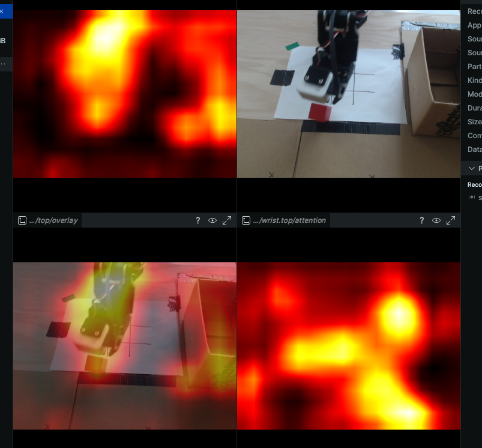

# lerobot_attention_visualizer

**See where your lerobot policy is looking, in real time.** Per-camera
attention overlays stream to [rerun](https://rerun.io) next to the raw
image while the policy drives the arm — so you can eyeball whether the
model is locked onto the block, the gripper, or a stray cable in the
background.

Built for debugging vision-language-action policies on real hardware. If
your VLA is misbehaving and you suspect the visual grounding rather than
the action expert, this is the cheapest way to check. Wrap a policy in a
context manager and three rerun streams (raw, heatmap, overlay) appear
per camera:

```python
from lerobot_attention_visualizer import SmolVLAAttention

viz = SmolVLAAttention(policy)
with viz:
    actions = policy.predict_action_chunk(obs_frame, ...)
    viz.log_overlay(obs)
```

That's the whole library surface. Everything in `examples/` is one
specific eval loop using it.

## Demo

**SmolVLA** — attention rollout across SigLIP ViT layers, replayed from a
recorded dataset (no hardware required):

<video src="docs/resources/replay_smolvla.mp4" controls width="720"></video>

**ACT** — ResNet-18 final-conv activation magnitude per camera while the
arm executes live on hardware:

<video src="docs/resources/active_act.mp4" controls width="720"></video>



## Compatibility

Targets **lerobot v0.5.1+** and **LeRobotDataset v3.0**. Hardware-agnostic:
works with any robot lerobot supports (SO-100, SO-101, Aloha, …). CUDA is
preferred for SmolVLA / π0; ACT runs comfortably on CPU.

## Policies supported

- **SmolVLA** — attention rollout across the SigLIP ViT layers.
  [`policies/smolvla.py`](src/lerobot_attention_visualizer/policies/smolvla.py).
- **Groot N1.5 / N1.6** — streams **two** signals per camera: the SigLIP
  encoder rollout (via Eagle-2's vision encoder, all cameras batched into one
  forward) *and* the action head's cross-attention — which vision tokens the
  flow-matching denoiser actually attends to while producing the action. The
  latter is the signal that moves when you fine-tune the action head; watch it
  for grounding bugs. Requires `flash-attn` — see [Groot install](#groot-n16)
  below. [`policies/groot.py`](src/lerobot_attention_visualizer/policies/groot.py).
- **π0 / π0.5 / π0-fast** — attention rollout across PaliGemma's vision
  tower. One adapter (`Pi0Attention`) handles all three since they share
  the `paligemma_with_expert.embed_image` layout.
  [`policies/pi0.py`](src/lerobot_attention_visualizer/policies/pi0.py).
- **ACT** — per-spatial-cell activation magnitude of the ResNet-18
  backbone's final conv stage.
  [`policies/act.py`](src/lerobot_attention_visualizer/policies/act.py).

Visualizing your own custom policy?
See [`docs/custom_policies.md`](docs/custom_policies.md) — the library
contracts on a small interface (HF-style vision encoder + a per-image
entry point) and the tutorial walks through three integration paths.

## What you get

Three rerun streams per camera per chunk:

```
attention/<cam>/image       # raw RGB
attention/<cam>/attention   # heatmap (red = high attention)
attention/<cam>/overlay     # blended 50/50
```

Updated once per RTC chunk (~every 10–20 control steps) for SmolVLA, and
once per ACT-queue refill (every `n_action_steps`) for ACT — enough to
read the story without burning compute.

**Groot streams two such groups per camera** — `attention/<cam>/encoder/*`
(vision-encoder self-attention) and `attention/<cam>/action/*` (action-head
cross-attention, the signal that moves when you fine-tune). The encoder view
shows what the frozen image encoder finds salient; the action view shows what
the denoiser actually attends to. SmolVLA / π0 currently expose the encoder
view only — action-head cross-attention for those is the next increment.

## Layout

```
src/lerobot_attention_visualizer/
├── visualizer/         # shared heatmap math + rerun streams
└── policies/           # per-policy adapters (smolvla, pi0, act)

examples/
├── smolvla_so101_rtc.py          # SmolVLA + RTC on a live SO-101
├── act_so101.py                  # ACT on a live SO-101
├── visualize_smolvla_dataset.py  # SmolVLA offline replay from a LeRobotDataset
└── visualize_groot_dataset.py    # Groot N1.6 offline replay from a LeRobotDataset

docs/                   # tutorials (custom policies, etc.)
docs/resources/         # demo videos and screenshots
```

## Install

Requires **Python ≥ 3.10** and **lerobot v0.4.3+**. Use a fresh conda env
so the heavy native deps (torch, cv2, pyrealsense, SDL/pygame) don't fight
an existing install:

```bash
conda create -n lav python=3.11 -y   # 3.10, 3.11, or 3.12 all work
conda activate lav
```

Both routes below install the same extras. Pick the ones matching the
policies you intend to visualize, plus any robot/camera extras for real
hardware:

| Use case               | Extra              |
| ---------------------- | ------------------ |
| SmolVLA                | `smolvla`          |
| π0 / π0.5 / π0-fast   | `pi`               |
| ACT                    | *(none — in core)* |
| SO-100 / SO-101 motors | `feetech`          |
| Aloha                  | `aloha`            |
| Intel RealSense camera | `intelrealsense`   |
| All of the above       | `all`              |

### PyPI

The quickest route — no git clone required:

```bash
pip install lerobot-attention-visualizer          # ACT only
pip install 'lerobot-attention-visualizer[smolvla]'           # + SmolVLA
pip install 'lerobot-attention-visualizer[smolvla,feetech,intelrealsense]'  # full SO-101 rig
```

### From source

Clone the repo and install in editable mode so local edits take effect
immediately:

```bash
git clone https://github.com/CursedRock17/lerobot_attention_visualizer
cd lerobot_attention_visualizer
pip install -e '.[smolvla]'                      # replace with your extras
```

If you need to track a specific lerobot git tag (e.g. during active lerobot
development), install lerobot first — pip will leave it alone when
resolving our deps:

```bash
pip install 'lerobot[smolvla,feetech] @ git+https://github.com/huggingface/lerobot.git@v0.5.1'
pip install -e '.[smolvla,feetech]'
```

### Groot N1.6 (verified GB10 / Blackwell stack)

Groot N1.6 is **not** loadable through lerobot's `GrootPolicy` — it's an
Isaac-GR00T-native `Gr00tPolicy` (Eagle3-VL = SigLIP2 + Qwen3). The
known-good environment is NVIDIA's Blackwell (GB10) image; mirror these exact
versions. Canonical reference:
[`Dockerfile.blackwell`](https://github.com/CursedRock17/Sim-to-Real-SO-101-Workshop/blob/gb10_current/docker/real/Dockerfile.blackwell).

| Component | Pin |
| --- | --- |
| Base image | `nvidia/cuda:13.0.0-devel-ubuntu24.04` |
| Python | `3.10` (deadsnakes PPA) |
| torch / torchvision / torchaudio | nightly, `--index-url https://download.pytorch.org/whl/nightly/cu130` |
| flash-attn | built `--no-build-isolation` |
| transformers / tokenizers | `==4.51.3` / `==0.21.4` |
| diffusers | `>=0.27.2,<0.36.0` |
| numpy | `==1.26.0` |
| Isaac-GR00T | `@ ead52833afbbf4243f8cd5e7664f48a94de03b19` (`pip install -e . --no-deps`) |
| lerobot | `@ e670ac5daf9b76` (`pip install -e . --no-deps`) |

```bash
# Install this package on the N1.6 branch (matches the workshop image):
git clone https://github.com/CursedRock17/lerobot_attention_visualizer.git
cd lerobot_attention_visualizer && git checkout groot_n16
python3 -m pip install --no-deps -e '.[smolvla]'
```

> **`--no-deps` gotcha.** The workshop image installs everything with
> `--no-deps` to protect its pinned versions, so this package's declared
> dependencies are **not** pulled in — including **`rerun-sdk`**, which the
> visualizer needs to render. Add it to your explicit pin list:
> `pip install 'rerun-sdk>=0.20'`. (`torch`/`numpy`/`lerobot` are already
> provided by the image.)

For detailed environment setup, follow
[NVIDIA's Isaac-GR00T install guide](https://github.com/NVIDIA/Isaac-GR00T).

## Run the examples

**No hardware? Start here** — replay a recorded dataset and visualize
attention frame-by-frame:

```bash
python examples/visualize_smolvla_dataset.py   # SmolVLA — edit POLICY_PATH + DATASET_REPO_ID at top
python examples/visualize_groot_dataset.py     # Groot N1.6 — same, requires flash-attn
```

**Live on a robot** — edit the constants at the top of each script
(follower port, camera serials, task description) then:

```bash
python examples/smolvla_so101_rtc.py   # SmolVLA + RTC + rollout
python examples/act_so101.py           # ACT + ResNet activation
```

Toggle `ATTENTION_ENABLED = False` at the top of either live script to
run the same control loop without the capture — useful for A/B-comparing
the policy's behavior with the instrumentation removed.

## Integrate into your own project

The whole library surface is two context managers; everything else in
`examples/` is just one user's eval glue. Drop into any existing lerobot
control loop:

```python
from lerobot_attention_visualizer import SmolVLAAttention   # or ACTAttention

viz = SmolVLAAttention(policy)
with viz:
    for step in range(num_steps):
        obs = robot.get_observation()
        # ... build the obs frame, call your policy as usual ...
        actions = policy.predict_action_chunk(obs_frame, ...)
        viz.log_overlay(obs)   # streams image / heatmap / overlay per camera
```

`viz.log_overlay(obs)` expects `obs` to be a dict mapping bare camera
names (e.g. `"top"`, not `"observation.images.top"`) to HWC `uint8`
ndarrays — that matches what `follower.get_observation()` returns. It is
a no-op on steps where no fresh forward happened (RTC queue still
buffered, ACT queue not yet refilled), so it is safe to call every step.

For visualizing a **custom policy** that subclasses or borrows from
SmolVLA / ACT, see [`docs/custom_policies.md`](docs/custom_policies.md).
